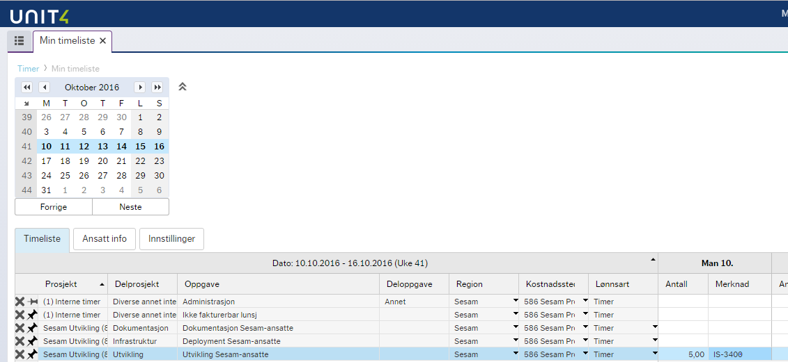

# JIRA/CurrentTime example

This is an example project that uses SESAM to compare the hours logged in JIRA and in CurrentTime.

##Overview
In Bouvet the consultants often have to log hours in two systems:

JIRA:
This is a bug/task tracking system. Here the consultants log how many hours they spent on each bug/task.

CurrentTime:
This is an time-tracking system. Here the consultants log how many hours they used on each project. 

The norm in Bouvet is that CurrentTime is used to bill the customers, so it is important that all 
hours are logged there. But we also want to keep track of how much time was spent on each task in 
JIRA, so we want to log hours in JIRA, too.

This causes problems, since it is time-consuming and error-prone to manually make sure that the 
number of hours in JIRA and CurrentTime matches up.

We therefore want to automate this process.
 
First, we need some way to connect the hours in JIRA with the hours in CurrentTime. There are no 
built-in way to doing this in JIRA or CurrentTime; the two systems do not communicate directly with 
each other in any way. We must therefore do it in a more 'un-official'. The method we will use here
is to type in the JIRA issue-key when logging hours in CurrentTime, like this:

The task of this SESAM installation is to find all CurrentTime worklog entries that refer to one or
more JIRA-issues and check that the number of hours in the CurremtTime worklog entry matches the 
total number of hours logged in the JIRA issues during that same day.
  
## Implementation details / logic

TODO

## How to run the SESAM installation

TODO

## Output

The final product is a csv-file containing all mismatches. It is served on this url: 

  `http://localhost:9042/api/publishers/workentries-in-currenttime-with-errors-csv/csv`

This file can be retrieved by pasting the url into a web-browser. Alternativly, it can be downloaded with a commandline tool:

On Linux, open a terminal and run this command:
   `curl -o errors.csv "http://localhost:9042/api/publishers/workentries-in-currenttime-with-errors-csv/csv"`

On Windows, start PowerShell and run this command: 
  `Invoke-WebRequest -Uri "http://localhost:9042/api/publishers/workentries-in-currenttime-with-errors-csv/csv"  -OutFile errors.csv`

  
The resulting cvs-file is fairly big and human unfriendly, but a good way to view it is to open the file in Microsoft Excel and
use Excel's functionality to do searching, filtering and sorting.  

